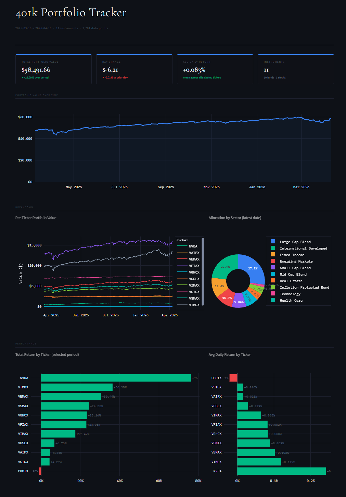

# 401k Portfolio Tracker

An end-to-end ELT pipeline that extracts daily stock and mutual fund prices from Yahoo Finance, transforms and models the data through a Bronze → Silver → Gold medallion architecture, and serves analytics via an interactive Streamlit dashboard.



---

## Overview

This project tracks a real 401k portfolio made up of 10 Vanguard mutual funds and 1 stock (NVDA). It was built to demonstrate a production-style data engineering workflow on a personal dataset — from raw extraction through dimensional modeling to a live dashboard.

The pipeline runs daily and the dashboard reads directly from a DuckDB Gold layer, making the full data flow visible end-to-end.

---

## Architecture

```
Yahoo Finance (yfinance)
        │
        ▼
┌───────────────┐
│    BRONZE     │  Raw daily prices → Parquet (append-only, one file per run)
└───────────────┘
        │
        ▼
┌───────────────┐
│    SILVER     │  Cleaned, standardized, incremental load → Parquet (watermark-based)
└───────────────┘
        │
        ▼
┌───────────────┐
│     GOLD      │  Kimball star schema → DuckDB (full refresh each run)
└───────────────┘
        │
        ▼
┌───────────────┐
│   STREAMLIT   │  Interactive dashboard reading from portfolio.duckdb
└───────────────┘
```

### Medallion Layers

**Bronze** — Raw extraction. One Parquet file written per pipeline run, append-only. Preserves the original Yahoo Finance schema with added metadata columns (`ingested_at`, `batch_id`, `source_system`). No transformations applied.

**Silver** — Cleaned and standardized. Implements watermark-based incremental loading — only Bronze records newer than the last processed `trade_date` are loaded each run. Renames columns to a consistent schema, nulls out meaningless OHLC fields for mutual funds, deduplicates on `(ticker_symbol, trade_date)`, and validates that prices are positive and dates are not in the future.

**Gold** — Analytics-ready star schema built with DuckDB. Full refresh each run from the authoritative Silver layer. Implements the Kimball dimensional model with SCD Type 2 historical tracking on `dim_stock`.

---

## Data Model (Gold Layer)

```
fact_stock_prices
├── price_key         (surrogate PK)
├── date_key          → dim_date
├── stock_key         → dim_stock
├── close_price
├── daily_return_pct  (computed via LAG window function)
├── portfolio_value   (baseline_value × current_price / first_price)
├── ingested_at
└── processed_at

dim_date
├── date_key          (YYYYMMDD integer — fast join key)
├── full_date
├── year / quarter / month / month_name
├── day_of_week
├── is_weekend
└── is_market_holiday

dim_stock             (SCD Type 2)
├── stock_key         (surrogate PK)
├── ticker_symbol
├── fund_name
├── sector
├── instrument_type   (mutual_fund | stock)
├── valid_from
├── valid_to
└── is_current
```

`portfolio_value` is calculated as:

```
baseline_value_usd × (current_close_price / first_ever_close_price)
```

This preserves the dollar magnitude of each holding while tracking its price-driven growth over time.

---

## Dashboard Features

- **KPI row** — Total portfolio value, day-over-day change, average daily return, instrument count
- **Portfolio value over time** — Aggregate trend line across all holdings
- **Per-ticker breakdown** — Individual fund value trajectories on a single chart
- **Sector allocation** — Donut chart showing current allocation by sector
- **Performance ranking** — Horizontal bar charts for total return and average daily return per ticker
- **Ticker deep dive** — Price history, daily return distribution histogram, and summary statistics for any selected instrument
- **Sidebar filters** — Date range, instrument type, sector, and individual ticker selection
- **Pipeline freshness panel** — Shows latest trade date and when Gold was last processed

---

## Tech Stack

| Layer | Tool | Purpose |
|---|---|---|
| Extraction | `yfinance` | Pull daily OHLCV data from Yahoo Finance |
| Transformation | `pandas` | Column renaming, type casting, deduplication, validation |
| Storage (Bronze/Silver) | `pyarrow` / Parquet | Columnar file storage |
| Storage (Gold) | `DuckDB` | Embedded analytical database, SQL transformations |
| Configuration | `PyYAML` | Ticker list, holding values, file paths |
| Dashboard | `Streamlit` + `Plotly` | Interactive web dashboard |
| Orchestration | `Apache Airflow` | Pipeline scheduling (DAGs in progress) |

---

## Holdings

11 instruments tracked across 8 sectors:

| Ticker | Name | Type | Sector |
|---|---|---|---|
| VFIAX | Vanguard 500 Index Adm | Mutual Fund | Large Cap Blend |
| VTMGX | Vanguard Developed Markets Adm | Mutual Fund | International Developed |
| VSIGX | Vanguard Intmdt-Term Treasury Idx | Mutual Fund | Fixed Income |
| VEMAX | Vanguard EM Markets St Idx Adm | Mutual Fund | Emerging Markets |
| VSMAX | Vanguard Small Cap Index Adm | Mutual Fund | Small Cap Blend |
| VIMAX | Vanguard Mid Cap Index Adm | Mutual Fund | Mid Cap Blend |
| VGSLX | Vanguard Real Estate Ind | Mutual Fund | Real Estate |
| VAIPX | Vanguard Inf-Protected Sec Adm | Mutual Fund | Inflation Protected Bond |
| CBOIX | Columbia Corp Income Inst | Mutual Fund | Corporate Bond |
| VGHCX | Vanguard Health Care Ind | Mutual Fund | Health Care |
| NVDA | NVIDIA Corporation | Stock | Technology |

---

## Project Structure

```
401k-portfolio-tracker/
├── pipelines/
│   ├── bronze/bronze_stock_prices.py   # Extraction → raw Parquet
│   ├── silver/silver_stock_prices.py   # Cleaning → incremental Parquet
│   └── gold/gold_stock_prices.py       # Star schema → DuckDB
├── dashboard/
│   └── app.py                          # Streamlit dashboard
├── validation/
│   ├── validate_bronze.py
│   ├── validate_silver.py
│   └── validate_gold.py
├── data/
│   ├── bronze/                         # Raw Parquet files (one per run)
│   ├── silver/                         # Cleaned Parquet + watermark
│   └── gold/                           # portfolio.duckdb (gitignored)
├── dags/                               # Airflow DAGs (in progress)
├── notebooks/
│   └── bronze-EDA.ipynb
├── pipeline_config.yaml                # Tickers, holdings, paths
└── requirements.txt
```

---

## Setup

**1. Clone the repo and create a virtual environment**

```bash
git clone https://github.com/yourusername/401k-portfolio-tracker.git
cd 401k-portfolio-tracker
python -m venv venv

# Windows
venv\Scripts\activate

# Mac/Linux
source venv/bin/activate
```

**2. Install dependencies**

```bash
pip install -r requirements.txt
```

**3. Run the pipeline**

Run each layer in order — each depends on the output of the previous:

```bash
python pipelines/bronze/bronze_stock_prices.py
python pipelines/silver/silver_stock_prices.py
python pipelines/gold/gold_stock_prices.py
```

**4. Launch the dashboard**

```bash
streamlit run dashboard/app.py
```

The dashboard opens automatically at `http://localhost:8501`.

---

## Design Decisions

**Why DuckDB for the Gold layer?** DuckDB is an embedded analytical database — it runs in-process with no server required, reads and writes Parquet natively, and supports full SQL including window functions. For a local ELT project it offers the performance and query expressiveness of a data warehouse without any infrastructure overhead.

**Why incremental loading in Silver but full refresh in Gold?** Bronze is append-only by design — it preserves a raw historical record of every extraction. Silver is incremental because re-processing all of Bronze every run would be wasteful as the dataset grows. Gold is a full refresh because it's cheap to rebuild from Silver and it guarantees the star schema is always consistent — no partial state, no stale dimension records.

**Why SCD Type 2 on `dim_stock`?** Fund metadata (name, sector, classification) can change over time. SCD Type 2 preserves the full history of those changes by closing old records and inserting new ones, rather than overwriting. This means historical fact rows always point to the correct version of the fund at the time of the trade, preserving analytical accuracy.

**Why surrogate integer keys instead of ticker symbols for joins?** Integers are faster to join on than strings — a Kimball best practice. More importantly, surrogate keys are what make SCD Type 2 possible: two versions of the same ticker can coexist in `dim_stock` with different `stock_key` values, allowing the fact table to point to the historically correct record.

---

## What's Next

- [ ] Airflow DAGs to automate the Bronze → Silver → Gold pipeline on a daily schedule
- [ ] Unit tests in the `tests/` directory
- [ ] Market holiday awareness in `dim_date`
- [ ] Deployment to a cloud environment (EC2 or similar) for always-on operation
